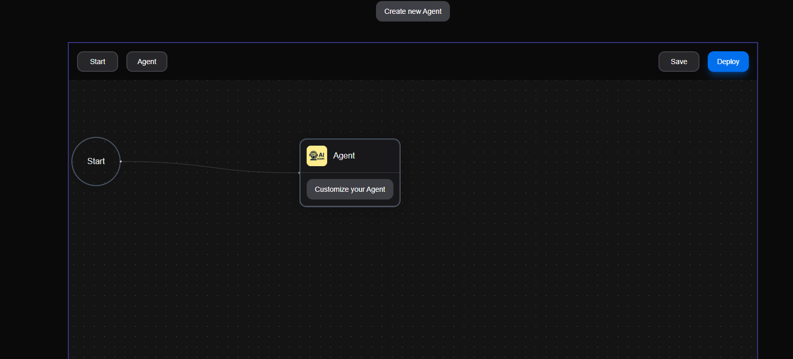
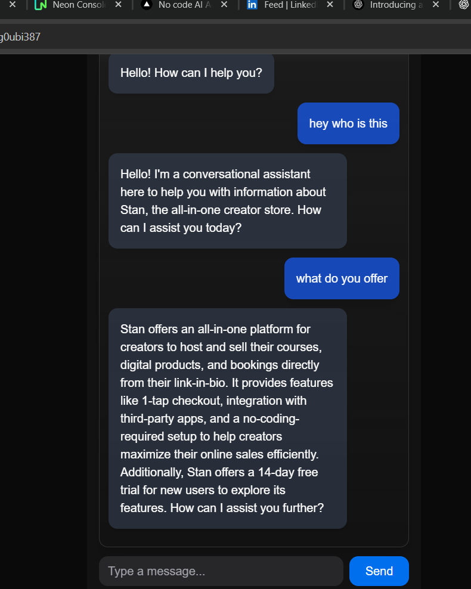
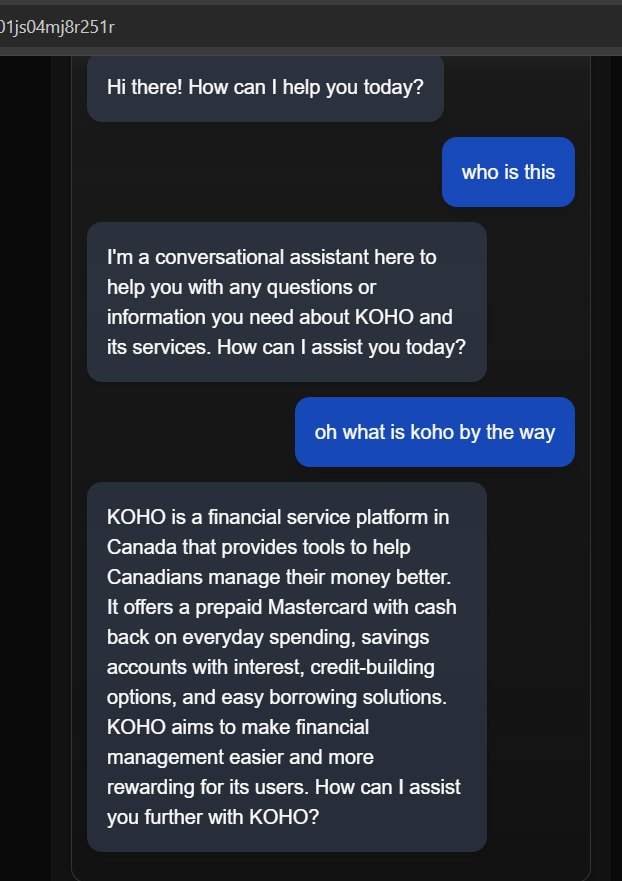

# AI Agent Builder

A **Next.js** + **TypeScript** project for building AI agents with **LangChain**, featuring **authentication with Clerk**. This project is designed to provide a flexible foundation for creating intelligent AI agents that can interact with users, external APIs, and data sources.

---

## Features

- **Next.js + TypeScript**: Fully typed modern React framework.
- **AI Agents**: Powered by LangChain for complex AI workflows.
- **Authentication**: Secure user login/signup with **Clerk**.
- **Flexible Agent Design**: Easily integrate LLMs, tools, and custom logic.
- **Scalable**: Designed to grow with multiple agents and workflows.

---

*This screenshot shows the simplified agent creation flow for non-technical users.*

---
## Created Agents

Here are some example agents you can try:

### 1. Stan Agent
  
[Try Stan Agent](https://www.stan.store/)

### 2. Koho Agent
  
[Try Koho Agent](https://www.koho.ca/)

