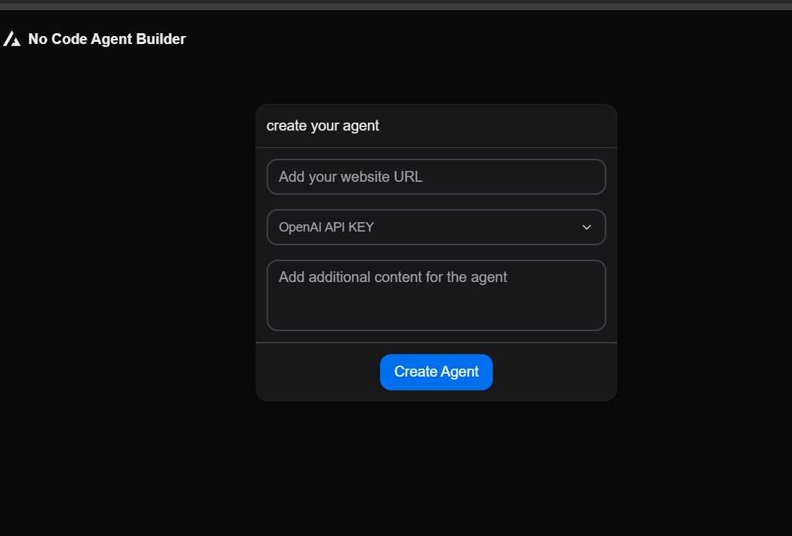

# AI Agent Builder

[](https://deepwiki.com/sukhad123/Nocode-agent-builder)

**AI Agent Builder** is a **Next.js + TypeScript** project for building intelligent AI agents with **LangChain**, featuring secure **authentication with Clerk**.  

This project provides a simple yet flexible foundation for creating AI agents that can interact with users, APIs, and various data sources — perfect for both developers and non-technical users.

---

## 🎯 Features

- **Next.js + TypeScript**: Modern, fully typed React framework.  
- **AI Agents**: Powered by LangChain for advanced AI workflows.  
- **Authentication**: Secure login/signup with **Clerk**.  
- **Flexible Agent Design**: Easily integrate LLMs, tools, and custom logic.  
- **Scalable**: Designed to grow with multiple agents and workflows.  

---

## 🛠️ How It Works

### Simplified Agent Creation Flow
Designed for **non-technical users**, this flow shows how easy it is to create AI agents:



*(For reference, here’s the original flow used in development)*  


---

## ▶️ Watch Me Create an Agent

See the full step-by-step tutorial in action:

[](https://www.youtube.com/watch?v=YOUTUBE_VIDEO_ID)  
*Click the image to watch the video on YouTube.*

---

## 🤖 Example Agents

Here are some agents created using this application:

### 1. Stan Agent
  
[Try Stan Agent](https://www.stan.store/)

### 2. Koho Agent
  
[Try Koho Agent](https://www.koho.ca/)

---

## ⚡ Quick Start

```bash
# Clone the repo
git clone https://github.com/yourusername/ai-agent-builder.git

# Install dependencies
npm install

# Run the development server
npm run dev
